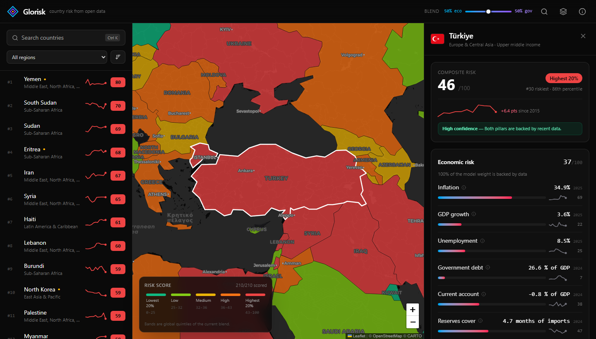
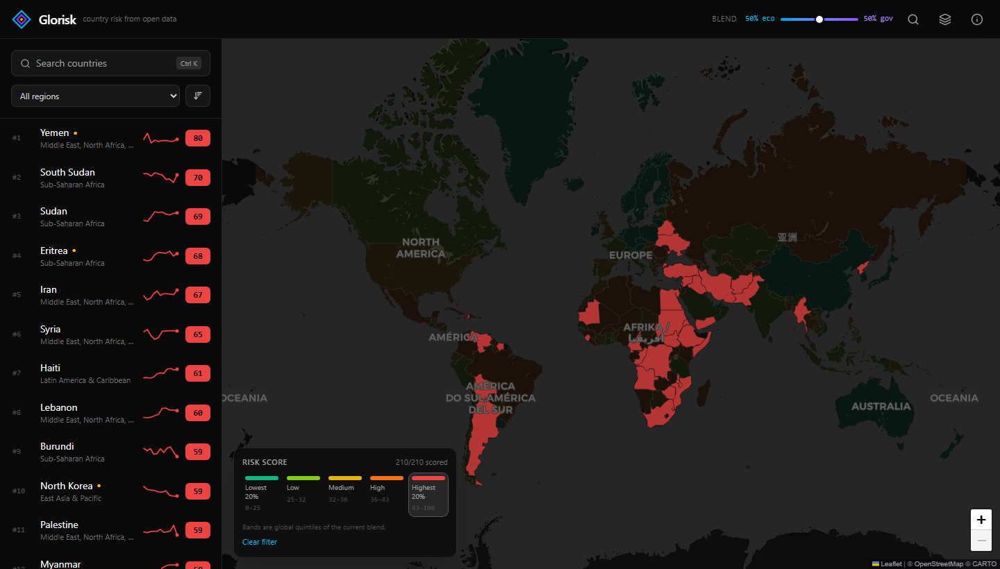
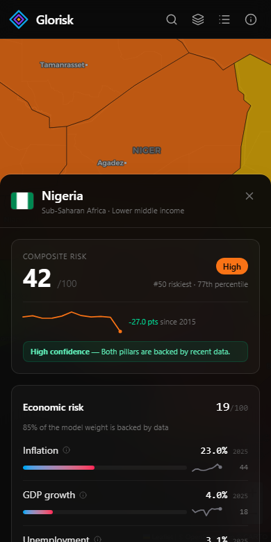

A world map of country risk, scored from open data. Pick a country and you get
the number, the six economic and six governance indicators behind it, how far
each one is from where you would want it, and how the whole thing has moved over
the last decade.

**→ [zeynepdorukk.github.io/Glorisk](https://zeynepdorukk.github.io/Glorisk/)**



## The score

Two pillars, twelve indicators, one number between 0 and 100.

| Economic pillar · World Bank | Weight | Governance pillar · WGI | Weight |
| --- | ---: | --- | ---: |
| Inflation | 25% | Political stability | 35% |
| GDP growth | 20% | Rule of law | 20% |
| Unemployment | 15% | Control of corruption | 15% |
| Government debt | 15% | Government effectiveness | 15% |
| Current account | 15% | Voice and accountability | 10% |
| Reserves cover | 10% | Regulatory quality | 5% |

Each indicator is mapped onto a 0-100 risk scale between a *best* and a *worst*
anchor — 2% inflation scores 0, 50% scores 100, anything beyond is clamped. The
indicators are averaged with the weights above, and the two pillars are blended
50/50 into the composite. That last ratio is a judgement call, so it is a slider
in the header rather than a constant: drag it and the map, the ranking and the
colour bands all recompute.

The whole model lives in [`src/lib/riskModel.js`](src/lib/riskModel.js), which
both the pipeline and the browser import, so the numbers can never drift apart.

### Missing data is the hard part

Statistics are thinnest exactly where risk is highest. Three rules keep that from
quietly corrupting the ranking:

- **Stale observations are dropped.** Anything older than six years counts as
  missing, so a 2018 debt figure cannot drive a 2026 score.
- **Weights are redistributed, and the loss is reported.** If government debt is
  unpublished, its 15% is spread over the remaining indicators and the country's
  *coverage* falls to 85%. The panel shows that figure.
- **A thin pillar is dropped, not the country.** Below 35% economic or 50%
  governance coverage a pillar stops counting toward the headline score. If only
  one pillar survives, the country is still scored and ranked, but flagged
  *limited data* — an amber dot in the ranking and a badge in the panel. Yemen,
  Eritrea and North Korea are all in that group; silently dropping them would
  have left the map's worst cases blank.

An earlier version simply excluded any country that failed the gates. It removed
Yemen, Syria, Venezuela, Myanmar and North Korea — which is a strange thing for a
risk map to do.

### Why the colours are quintiles

Composite scores cluster: the WGI 0-100 score is a linear rescaling of an
estimate that itself sits in a narrow band, and most countries end up between 20
and 50. With fixed cut-offs at 20/40/60/80 the entire world came out one shade of
green. So the five bands are **global quintiles of the current blend** — each
band always holds a fifth of the scored countries, and the legend shows the score
range each one currently spans. Move the pillar slider and the thresholds move
with it.



## Architecture

There is no server. A Node pipeline pulls the data, does every bit of scoring,
and writes static JSON; the browser fetches those files and never talks to a
third-party API at page load. That is what makes the site fast, offline-friendly
for the CDN, and immune to someone else's rate limit.

```
scripts/etl/
  worldbank.mjs   paginated API client with retries
  build.mjs       scores 210 countries, writes public/data/*
  verify.mjs      refuses to publish a broken dataset
scripts/branding/
  build-icons.mjs renders the favicon and PNG icons from public/logo.svg
src/lib/
  riskModel.js    indicators, weights, scoring, bands (shared with the ETL)
  useRiskData.js  loads the data, re-blends on weight change, ranks, bands
public/data/
  countries.json  latest values, pillar scores, trajectory, confidence  (230 kB)
  history/<ISO3>  ten-year series per indicator, fetched only when a country
                  is opened
  world.geo.json  country geometry, kept out of the JS bundle
```

A scheduled Action rebuilds the datasets every morning, runs `verify.mjs`,
commits **only if something actually changed**, and redeploys. `verify.mjs` is
the interesting half: it checks that at least 150 countries scored, that every
score is in range, that no ISO3 code is duplicated, that at least 90% of the map
polygons joined to a record, and that the indicator definitions in `meta.json`
still match the model. A World Bank outage fails the job instead of publishing a
half-empty map.

## Interface notes

- Selection, band filter and pillar blend all live in the URL:
  [`?c=TUR&w=70`](https://zeynepdorukk.github.io/Glorisk/?c=TUR&w=70) is a
  shareable view.
- `Ctrl`/`Cmd` + `K` or `/` opens a command palette; prefix matches rank above
  substring matches, so "turk" finds Türkiye before Turkmenistan.
- The choropleth sits on a CARTO dark basemap with place labels in a **pane above
  the fill**, so country names stay readable at 75% opacity.
- The GeoJSON layer is created once and restyled in place. Re-mounting 180
  polygons on every hover, as the first version did, is why it used to stutter.
- One layout is mounted at a time, chosen by a media query rather than by
  `hidden lg:block` — otherwise both the desktop panel and the mobile sheet exist
  in the DOM, fetch the same data twice, and hand screen readers two copies of
  every heading.



## Development

```bash
npm install
npm run dev         # Vite dev server
npm test            # unit tests for the scoring model
npm run lint
npm run build

npm run etl         # rebuild public/data from the World Bank API (~3 min)
npm run etl:verify  # sanity check the generated datasets
npm run icons       # regenerate favicon.ico and the PNG icons from the logo
```

The tests cover the parts where a silent mistake would be invisible on screen:
anchor clamping, weight redistribution when indicators are missing, quantile
interpolation, and the guarantee that each pillar's weights sum to one.

## Brand

Three nested geometric layers — reach, exposure, and the flagged core — in three
colours that carry through the interface.

| | Hex | Used for |
| --- | --- | --- |
| Sky | `#0EA5E9` | Outer layer, economic pillar, links |
| Violet | `#7C3AED` | Middle layer, governance pillar |
| Amber | `#F59E0B` | Core, limited-data flags, warnings |

`public/logo.svg` is the source; `npm run icons` renders `favicon.ico` (16-64),
`icon-192.png`, `icon-512.png` and `apple-touch-icon.png` from it. Icons at 32px
and below drop the middle layer, which turns to mush at that size, and the touch
icon ships on the dark tile because iOS ignores transparency.

## Limitations

This is an open-data project, not an investment or travel advisory.

Governance indicators are published once a year and lag reality — the WGI figures
for a country at war can look surprisingly unremarkable. Macro statistics get
revised. Anchor values are defensible but not neutral: choosing 50% inflation as
"worst" is a decision, and a different choice reorders the middle of the table.
And a single number can say that a country is risky without ever saying why, which
is the whole reason the panel exposes the components.

A live news layer was built on GDELT and then removed. The API refuses shared
addresses, so the scheduled harvest returned almost nothing; it omits CORS headers
on throttled responses, so the in-browser fallback failed opaquely; and its
topical queries returned articles about other countries entirely — Argentina's
panel once listed a concert in Chile. Headlines that look plausible but belong
somewhere else are worse next to a risk score than no headlines at all. What
replaced it is the *In context* block: rank within region, rank within income
group, and the three closest scores worldwide, all derived from data that is
always there.

## Sources

- [World Bank Open Data](https://data.worldbank.org) — macro-economic indicators
- [Worldwide Governance Indicators](https://www.worldbank.org/en/publication/worldwide-governance-indicators) — governance scores, regions, income groups
- Basemap tiles © [OpenStreetMap](https://www.openstreetmap.org/copyright) contributors, © [CARTO](https://carto.com/attributions)
- Flags from [flagcdn.com](https://flagcdn.com)
